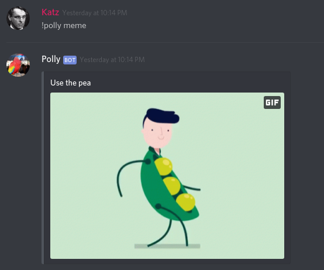

# 🐦 Polly 🐦 

Inspired by [subreddit simulator](https://www.reddit.com/r/SubredditSimulator/) and [Andrew Jackson's pet parrot](https://medium.com/omgfacts/the-true-story-of-andrew-jacksons-swearing-parrot-6189abaa3155), Polly is a Cleverbot that learns to mimic your server members! Polly uses Markov chains custom-made from the messages on *your* server in order to pick up on - and learn to imitate - the nuances of your server's dialect. It's so smart, you won't even realize that you're talking to a bot(*)!

You have my promise that I'm not going to sell your chatlogs to any sketchy guys in trenchcoats. In fact, your chatlogs aren't stored anywhere at all (and even if they were, I have a strict no-trenchcoat policy when it comes to my software). The resulting Markov Chains, however, are saved, although they're basically decodable assuming you have more than a few messages on your server. This should be fine safety-wise unless you're sending nuclear launch codes through your server channels.

(*) No guarantees. In fact, you'll probably be able to tell pretty easily.

## Samples

 
  

## Note to the Discord Gods

Thank you so, so much for putting on this hackathon; it was truly a blast to get a chance to create a discord bot (something that has been on my to-do list for quite a while). As per the rules, all of my code was written on June 24 - 28. You may be wondering about my own package that I used as an import, [gojam](https://github.com/MYKatz/gojam). Be assured that this, too was created during over the length of the competition. I just decided to spin in off as its own standalone library for future improvements.

# Commands

## Moderator/owner-only
To adjust settings, etc.

### !polly setup [#channel1] [#channel2] [#channel3]...
Uses the message history in these selected channels to build the model it uses to generate text. Please ensure that you give it a space-separated list of channel ids. Invalid channel ids will simply be skipped.

### !polly usepreset kanye/beemovie/discord
Alternatively to the setup command, you can have Polly use a pre-created model to write its messages. The 'kanye' option was trained from all of Kanye West's discography, 'beemovie' was from the entire bee movie script, and 'discord' was created from a couple articles on discord. Try 'em out, especially the Kanye one :)

### !polly setmode silent/normal/chatty
When Polly is set to 'silent', it won't create messages unless specifically invoked. 'normal' and 'chatty' Polly will occasionally randomly respond to other messages in the server, but 'chatty' obviously to a much higher degree.

## Commands for everybody!
Any user can invoke these.

### !polly say
Has Polly send a message.

### !polly meme
Polly will search through the interwebs and hand-pick a meme that corresponds to its training data (and add a caption!). Weird GIFs are often the result:

# Installation

Want to have Polly join your server? You have three options:

## Add the existing bot to your server

Simply [click here](https://discordapp.com/api/oauth2/authorize?client_id=592958984730837002&permissions=117760&scope=bot) - note that you gotta be a mod on the server you want to add it to. I also can't make any guarantees about uptime, but by some back-of-the-napkin calculations I estimate my hosting setup can handle at least a couple hundred concurrent sessions.

## Deploy the code to Heroku (Free!)

Press the above button to deploy Polly's code to Heroku, which has a free plan available. Unfortunately, the disk space on Heroku's dynos is ephemeral, so your configuration will be lost every time your dyno goes to sleep. If you're a student, you can remedy this by getting a free [hobby dyno](https://www.heroku.com/github-students) - which won't be forced to go to sleep.

The bot won't run until you add configuration details as environment variables. Here's a screenshot (with some parts whited out) of the necessary variables:

You can also find more details in config.example.toml

## Run the code somewhere else.

Clone this git repo to a system with an internet connection and Go 1.12 installed, then run

`go build && ./Polly`

# Questions, comments, feedback, criticism, cat pics?

I accept 'em all. Add me on Discord (Katz#8928) if you want to chat.